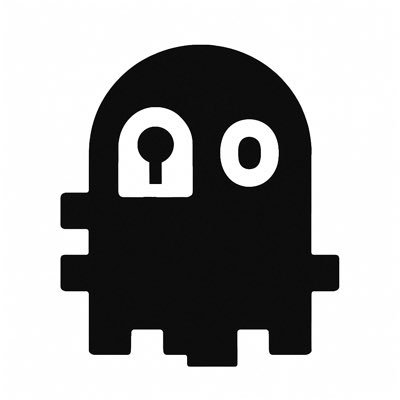

  

# 👾 Taridoku (gh0xt) - **Web3 Security Researcher & Solidity Auditor**

---

## 🧑‍💻 About Me  
I’m a **Web3 Security Researcher & Solidity Auditor**, focused on uncovering vulnerabilities in smart contracts and DeFi protocols. I actively participate in **audit contests** on platforms like Sherlock & Cantina.

My approach combines:  
- **Manual review** of protocol logic & invariants  
- **Fuzzing & invariant testing** with Foundry  
- **Economic & design-level analysis** of protocols

---

## 🔨 Skills & Tools  
- **Languages:** Solidity
- **Testing Frameworks:** Foundry
- **Security Methods:** Invariant Testing, Fuzzing 

---

## 📂 Featured Work 
### Sherlock
- **Neutrl:** A market-neutral synthetic dollar designed to unlock untapped yield opportunities in OTC and altcoin markets. https://audits.sherlock.xyz/contests/1065/leaderboard
- **Malda:** A Unified Liquidity Lending protocol on Ethereum and Layer 2s, delivering a seamless lending experience through global liquidity pools, all secured by zkProofs. https://audits.sherlock.xyz/contests/1029/leaderboard
- **Burve:** A 16-token multi-swap for pegged assets launching on Berachain with rehypothecation yields, moving peg handling, an analytic stableswap solution, depeg-protection, and subset-LPing so users can limit themselves to tokens they feel safest in. https://audits.sherlock.xyz/contests/858/leaderboard
### Cantina
- **Superform:** A modular DeFi protocol for yield abstraction that allows dynamic execution and flexible composition of user operations via ERC7579 modules. https://cantina.xyz/code/ba62fa4e-f933-4eec-b9ac-868325f4a694/overview/leaderboard

---

## 🤝 Connect  
- **X:** https://x.com/Taridoku   
- **Discord:** https://discordapp.com/users/taridoku
