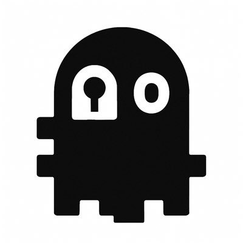

  

# 👾 Taridoku (gh0xt) - **Web3 Security Researcher & Solidity Auditor**

---

## 🧑‍💻 About Me  
I’m a **Web3 Security Researcher & Solidity Auditor**, focused on uncovering vulnerabilities in smart contracts and DeFi protocols. I actively participate in **audit contests** on platforms like Sherlock & Cantina.

My approach combines:  
- **Manual review** of protocol logic & invariants  
- **Fuzzing & invariant testing** with Foundry  
- **Economic & design-level analysis** of protocols

---

## 🔨 Skills & Tools  
- **Languages:** Solidity
- **Testing Frameworks:** Foundry
- **Security Methods:** Invariant Testing, Fuzzing 

---

## 📂 Featured Work 
- [Sherlock Profile](https://audits.sherlock.xyz/watson/gh0xt)
- [Cantina Profile](https://cantina.xyz/u/gh0xt)

---

## 🤝 Connect  
- [X](https://x.com/Taridoku)    
- [Discord](https://discordapp.com/users/taridoku) 
- [Telegram](https://t.me/taridoku)